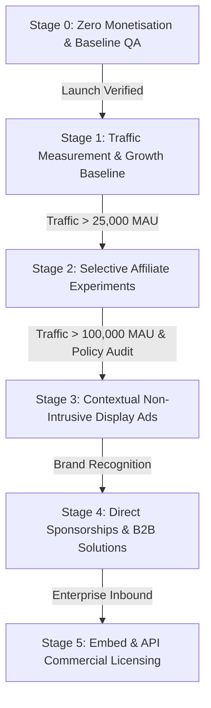

# Monetisation Rollout Plan

This document defines the phased, evidence-based roadmap for platform monetization, including quantitative traffic thresholds and decision gates.

---

## Rollout Stages

---

### Stage 0: Zero Monetisation (Current Phase 6 State)
* **Status:** Active baseline.
* **Configuration:**
  - `NEXT_PUBLIC_ENABLE_ADS="false"`
  - `NEXT_PUBLIC_ENABLE_AFFILIATES="false"`
* **Deliverables:** Architecture ready, components built, zero live commercial scripts or external partners.
* **Exit Gate:** All regression, performance, and accessibility tests pass.

---

### Stage 1: Traffic & Engagement Measurement
* **Objective:** Establish real organic search baseline, traffic volume, and user demand per calculator category.
* **Prerequisites:**
  - Live deployment on `https://ukcalc.jomovate.com`.
  - Search Console and Bing verification completed.
  - Privacy-friendly analytics enabled with user consent.
* **Milestone:** Collect 3 months of baseline usage data.

---

### Stage 2: Selected Affiliate Experiments
* **Objective:** Pilot high-relevance, transparent commercial links on non-sensitive utility and business tools.
* **Prerequisites:**
  - Verified organic monthly active users (MAU) > 25,000.
  - Negotiated partner contracts with legitimate UK service providers (e.g. accounting software, energy comparison).
  - Explicit commercial disclosure badge on all sponsored links.
* **Safeguards:** No pay-to-rank algorithms; no influence over calculator numbers.

---

### Stage 3: Limited Display Placements
* **Objective:** Activate privacy-respecting, high-quality programmatic display ads in pre-defined `AdSlot` locations.
* **Prerequisites:**
  - Verified organic MAU > 100,000.
  - Zero Cumulative Layout Shift (CLS) verification.
  - Health, pregnancy, debt, and clinical tools strictly excluded.
* **Safeguards:** Fixed dimensions, no interstitials, no sticky overlays covering results.

---

### Stage 4: Direct Sponsorship & B2B Partnerships
* **Objective:** Establish direct category or tool sponsorships with trusted UK institutions, financial educators, or industry bodies.
* **Prerequisites:**
  - Dedicated partner vetting against the Monetisation Policy.
  - Written sponsorship agreements maintaining complete editorial independence.

---

### Stage 5: Commercial Embed & API Licensing
* **Objective:** Provide commercial API keys, white-label customisation, and high-volume embed licenses for enterprise clients.
* **Prerequisites:**
  - Rate limiting and API gateway infrastructure.
  - Commercial SLA and support capabilities.
